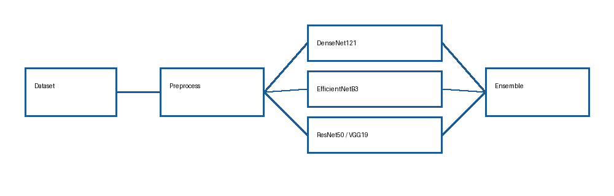

# Architecture

This project classifies eye images into Immature, Mature, and Normal classes
using four transfer-learning models: DenseNet121, EfficientNetB3, ResNet50,
and VGG19.

The training flow mirrors the original notebooks:

```text
dataset -> preprocessing -> model head training -> selective fine-tuning -> evaluation
```

The inference flow loads the registered trained models, applies each model's
matching Keras preprocessing function, and combines predictions with either
simple per-model argmax, average probability, or accuracy-weighted confidence.


